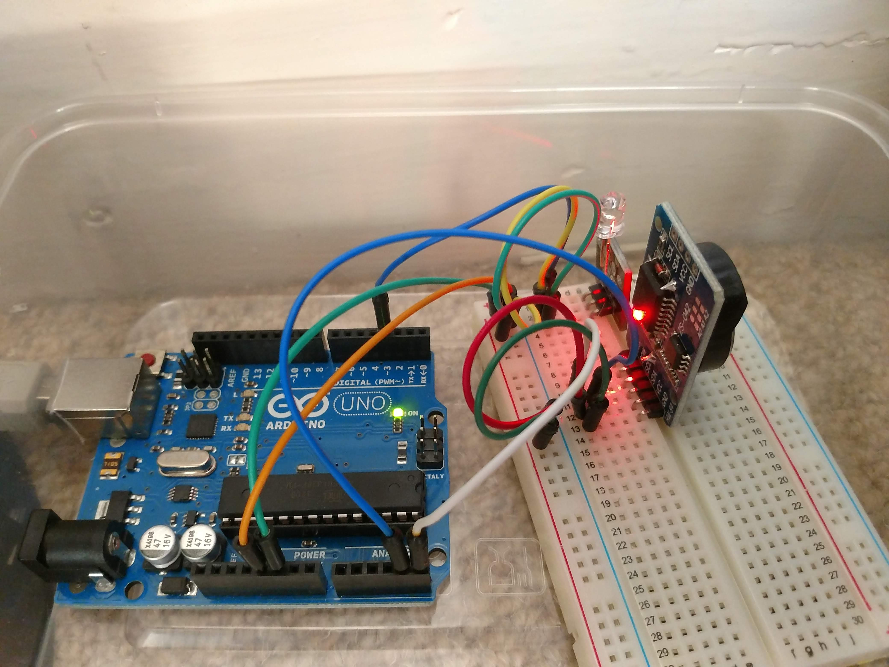

# Infrared Scheduler

Transmits infrared light on schedule

## Background

I wanted to turn on Dyson AM09 Hot + Cool Fan Heater in the morning automatically before I wake up. Unfortunately, this is not a built-in feature in the heater.

## Circuit



Library used:
- https://github.com/z3t0/Arduino-IRremote
- https://github.com/NorthernWidget/DS3231

Components used:
- RTC DS3231 ([purchased](https://www.ebay.co.uk/itm/DS3231-AT24C32-I2C-Precision-Real-Time-Clock-Memory-Module-for-Arduino/202481326337))
- IR Transmitter module ([purchased](https://www.ebay.co.uk/itm/KY-005-Infrared-LED-Module-Transmitter-IR-5mm-Remote-Arduino-PI-Pic-ARM/232935178650))

## Getting the IR raw code

The code in this repository contains a hardcoded raw IR code for Dyson AM09. If you're trying to re-use the code in the repository for other electronic appliances, you'll have to find the raw code that you have to transmit. This is what I did to get the raw IR code:
1. I've purchased a IR receiver module ([purchased](https://www.ebay.co.uk/itm/KY-022-Infrared-Receiver-Sensor-Module-Detector-IR-TSOP1838-37-9kHz-Arduino-Pic/232749508970))
2. Use the module in my Arduino
3. Use [IRreceiveDumpV2](https://github.com/z3t0/Arduino-IRremote/blob/master/examples/IRreceiveDumpV2/IRreceiveDumpV2.ino) example project to dump the raw code
4. Go to "Arduino Create" serial monitor
5. Press the power button on my Dyson remote control

The `IRreceiveDumpV2` will log the following in the serial monitor

```
Encoding  : UNKNOWN
Code      : 0x4C73CC7 (32 bits)
Timing[33]: 
     +2200, - 750     + 700, - 750     + 700, - 800     + 700, -1400
     + 700, -1400     + 700, - 750     + 700, - 750     + 700, - 700
     + 700, - 800     + 700, - 750     + 750, - 750     + 700, - 750
     + 700, - 750     + 700, - 750     + 650, - 750     + 700, - 750
     + 700
Pronto Hex: 0000 006D 0011 0000 0055 001D 001B 001D 001B 001F 001B 0036 001B 0036 001B 001D 001B 001D 001B 001B 001B 001F 001B 001D 001D 001D 001B 001D 001B 001D 001B 001D 0019 001D 001B 001D 001B 0806 
unsigned int  rawData[33] = {2200,750, 700,750, 700,800, 700,1400, 700,1400, 700,750, 700,750, 700,700, 700,800, 700,750, 750,750, 700,750, 700,750, 700,750, 650,750, 700,750, 700};  // UNKNOWN 4C73CC7
```

The data that you'll need is the line of code that starts with `unsigned int  rawData[33]`.

**Caveat**: Do note that the code that will be printed out is never the same, I grabbed the first one and it worked.
